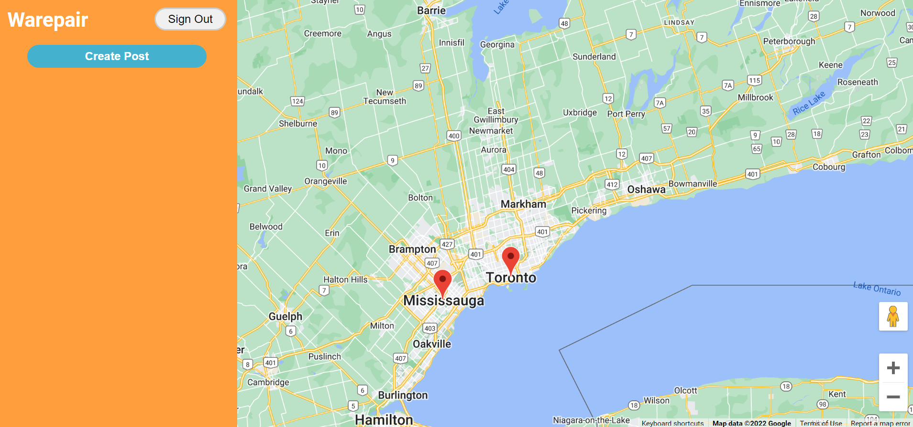

# Warepair

## [Check it out on Heroku](https://warepair.herokuapp.com/)

## Description

Warepair is a web app that bridges the gap between these two groups of people. It is a platform that allows contractors and clients to easily find each other.

## Why?

Currently, there are no centralized platforms for contractors and clients to find each other. Contractors cannot find clients and the clients cannot find contractors. We want to create a easy-to-use platform that enables both groups to find each other.

## Features

- Universal account for both contractors and clients
- Built-in Google Maps integration with markers
- Automatic notifications for contractors when a request is created nearby
- Customizable profile page for both contractors and clients

## Next Steps

- Implement features such as verification and rating system for contractors, checkout process
- Dashboards for contractors to discover which area have the most relevant and profitable contracts
- Create a mobile app
